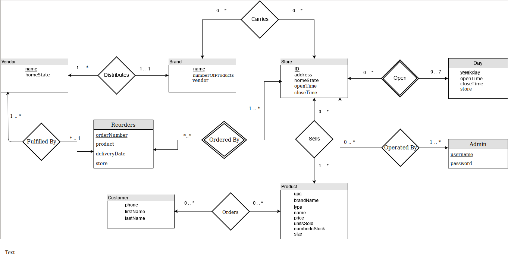

# WegmansCLI

### Developers 
- Ryan Cervantes (rxc3202@rit.edu)
- Jorge Flores (jaf9897@rit.edu)

### Instructions to Run
1. Download Source Code
2. Download and install Java JDK (we used [1.8](https://www.oracle.com/technetwork/java/javase/downloads/jdk8-downloads-2133151.html))
3. Find ```wegmans2.sql``` in ```/etc```
4. Build database using ```pg_restore --no-owner --clean wegmans2.sql```
5. Navigate to ```out/artifacts/WegmansCLI_jar```
6. Run ```java -jar WegmansCLI.jar <host> <port> <user> <password> <dbname>```

**_NOTE_**: make sure your ```<dbname>``` matches your database's name from step 3, which should be ```wegmans2```.
Databases are not verified and this will lead to an unusable program stuck at login.

Description
===========
This report will outline our project for the prestigious Wegmans2 company. 
Wegmans2 is a growing company and needs to upgrade their business to a more modern system. 
As such, they have hired us to create a database that will track multiple aspects of their day-to-day 
administrative and retail factors. Additionally, they have asked us to create a programmer-friend 
command-line interface for this backend. 

As specified by Wegmans2, the database must keep track of retail and administrative factors of 
their business. For the retail aspects, we were tasked to keep track of customers and 
any items they have purchased through our application. For the administrative aspects,
 we were tasked to keep track of information about physical stores 
 (i.e. address, open time, close time), the items they sell (name, price, brand, vendors, 
 number in stock), and restocking (items requested, when they were delivered,
  what store requested them). 

The application itself must have a dual purpose. First, it must serve as a customer portal 
through which customers are able to purchase items. This includes all the intermediary 
steps of a larger company’s online presence such as logging in, choosing a store, browsing 
inventory, adding items to a cart, and checking out. Secondly, it must serve as an 
administrative hub where by administrators may modify the operations of wegmans. 
This includes things such as updating item prices, adding/removing items to a store’s 
inventory, requesting reorders, and approving reorders. Finally, Wegmans2 has also asked 
us to make the application have the ability to gather business statistics about their 
business. This will include things such as finding the MVP customer, finding the best/worst stores, 
and finding the worst/best items. 

ER-Diagram and Relational Model
==========


The above E-R diagram models the different entities within the domain of the application. 
We designed this application with 6 entities that would interact with each other to yield the 
desired functionality: Store, Product, Brand, Vendor, and Customer. From there, we could use 
different relationships to describe how the entities interacted with one another. The general idea 
of the domain is as follows:

“A __Store__ *sells* multiple __Products__, which can be bought by a __Customer__. 
Each product is *carried by* a __Brand__ and brands are *distributed by* a __Vendor__. When a 
store runs out of a specific product, an administrator may have a store *order* a 
__Reorder__ which will then be fulfilled.


Admin Command Synopsis
======================
```
help    Displays help information about the specified command
quit    quit the application
store   allows the user to do store related actions
   search                                      search for active stores
       -i, --item-name=<item_name>                    search stores that have a particular item
       -s, --state=<state_abbr>                       search by state abbreviation (i.e MA)
       -t, --times=<start>=<end>[|<start>=<end>...] 4-digit number representing 24-hr time
   set     <id>                                set your current store
   show                                        show your current store
   view-brands      view brands for your current store
   view-inventory   view your current store's inventory
   view-vendors     view vendors for your current store
   update-price  <price>   update a price for the entire wegmans2 chain
       -u, --upc=<upc>    set a price by upc
       -n, --name=<name>   set a price by name
   request-reorder <store-id> <product-name> <quantity> request a reorder for an item in a store
   fulfill-reorder  fulfill a store's need for an item
browse     allows the user to browse wegmans inventory
   -b, --brand=<brand>                                 query by brand name
   -n, --name=<name>                                   search a product by name
   -r, --price-range=<start>=<end>[|<start>=<end>...]  A double representing 24-hr time
   -t, --type=<type>                                   the type of product you want to search for
statistics, stats  get statistics about how wegmans2 is doing
   customer-mvp  gets the customer who has spent the most money
   item-sales    get first 3 best or worst items sold
           --rank=TOP|BOT                              either display the top or bottom three items
       -a, --all                                       search all store's best/worst items
   store-sales   gets the customer who has spent the most money
         --rank=TOP|BOT                                display top or bottom store in sales
       -s, --state=<state_abbr>                        narrow sales search to a specific state
update     update certain aspects of the database
   add-customer <firstname> <lastname> <phonenumber>   add a customer to the database
   remove-customer <phonenumber>   remove a customer from the database
   remove-location <store-id>      remove a store from the database
```
Customer Command Synopsis
=========================

```
help    Displays help information about the specified command
quit    quit the application
cart    allows the user to do cart based actions
   add       <item_name> <count>                      Add an item to your cart
   remove    <item_name> <count>                      remove an item from your cart
   checkout                                           finalize your purchase
   show      Show the contents of your cart
store   allows the user to do store related actions
   search   search for active stores
       -i, --item-name=<item_name>                    search stores that have a particular item
       -s, --state=<state_abbr>                       search by state abbreviation (i.e MA)
       -t, --times=<start>=<end>[|<start>=<end>...]   4-digit number representing 24-hr time
   set     <id>   set your current store
   show           show your current store
browse     allows the user to browse wegmans inventory
   -b, --brand=<brand>                                query by brand name
   -n, --name=<name>                                  search a product by name
   -r, --price-range=<start>=<end>[|<start>=<end>...] A list of key=value pairs in form <XX.XX>=<XX.XX>
   -t, --type=<type>                                  the type of product you want to search for
```

SQL Queries
===========

### All Users
> These queries can be used by both customers and admins

Find a store by an id
```sql
SELECT * FROM Store WHERE id = ?
```

Find all stores that are open between a start time and an end time
```sql
SELECT * FROM Store WHERE openTime >= ? AND closeTime <= ?
```

Find all stores in a given state
```sql
SELECT * FROM Store WHERE state = ?
```

Get all stores that carry a specific product
```sql
SELECT * FROM Store WHERE id IN 
  (SELECT storeID FROM soldBy WHERE productid IN (SELECT upc FROM Product WHERE name = ?))
```

Get all products with a given name
```sql
SELECT * FROM Product WHERE name = ?
```

Get a product with a specific UPC
```sql
SELECT * FROM Product WHERE upc = ?
```

Find all products in a given store with a certain name
```sql
SELECT product.* 
FROM Product JOIN soldBy ON soldBy.productId = product.upc 
WHERE soldBy.storeId = ? AND product.name = ? ORDER BY product.name ASC
```

Find all products in a given store within a certain price range
```sql
SELECT product.* 
FROM Product JOIN soldBy ON soldBy.productId = product.upc 
WHERE soldBy.storeId = ? AND product.price > ? AND price < ? 
ORDER BY product.name ASC
```

Find all products within a certain range and are of a certain type (i.e Snack)
```sql
SELECT product.* FROM Product JOIN soldBy ON soldBy.productId = product.upc 
WHERE soldBy.storeId = ? AND product.price > ? AND price < ? AND type = ? 
ORDER BY product.name ASC
```

Find all products in a store that are of a certain brand
```sql
SELECT product.* 
FROM Product JOIN soldBy ON soldBy.productId = product.upc 
WHERE soldBy.storeId = ? AND brand = ?
```

Find all products in a store that are of a certain type
```sql
SELECT product.* 
FROM Product JOIN soldBy ON soldBy.productId = product.upc 
WHERE soldBy.storeId = ? AND type = ? ORDER BY product.name ASC
```

Find all products in a store
```sql
SELECT product.* 
FROM Product JOIN soldBy ON soldBy.productId = product.upc 
WHERE soldBy.storeId = ? ORDER BY product.name ASC
```

 
### Admin Specific
> These queries can be used by an administrator to modifiy the database or gather statistics from the database

Update the price of a specific item
```sql
    UPDATE Product SET price = ? WHERE upc = ?
```

Update the price of an item with a specific name
```sql
    UPDATE Product SET price = ? WHERE name = ?
```

Get all the order numbers
```sql
    SELECT orderNumber FROM Reorder
```

Remove an item from a store by UPC code
```sql
    DELETE FROM soldBy WHERE storeId = ? AND productId = ?
```

Add an item to a store by product id
```sql
    INSERT INTO soldBy (storeId, productId) VALUES (?, ?)
```

Delete a customer from the database
```sql
    DELETE FROM customer WHERE phonenumber = ?
```

Remove a store from the database
```sql
    DELETE FROM store WHERE storeID = ?
```

Create a customer
```sql
    INSERT INTO customer VALUES (?, ?, ?)
```

Find if a customer is is registered
```sql
    SELECT * FROM customer WHERE phonenumber = ?
```

Get all the unfulfilled ordered 
```sql
    SELECT orderNumber, product, store, stockRequested FROM Reorder WHERE deliveryDate IS NULL
```
 
 Update the stock of an item in a certain store based on a reorder
 ```sql
    UPDATE soldBy 
    SET numberInStock = 
      ((SELECT stockRequested FROM reorder WHERE store = ? AND product = ?) 
      + (SELECT numberInStock FROM soldBy WHERE storeId = ? AND productId = ?)) 
    WHERE storeId = ? AND productId = ?
 ```
 
 Update the reorder table
 ```sql
    UPDATE reorder 
    SET deliveryDate = ?, fulfilledBy = 
      (SELECT distributedBy.vendor 
       FROM distributedBy JOIN Product ON distributedBy.brand = product.brand 
       WHERE product.upc = ?) 
    WHERE orderNumber = ?
 ```
 
 Get all the brands from a specific store
 ```sql
    SELECT DISTINCT Product.brand 
    FROM product JOIN soldBy ON soldBy.productId = product.upc 
    WHERE soldBy.storeId = ? ORDER BY Product.brand ASC
 ```
 
 Get all the vendors from a specific store
 ```sql
    SELECT DISTINCT distributedBy.vendor 
    FROM product JOIN soldBy ON soldBy.productId = product.upc 
      JOIN distributedBy ON product.brand = distributedBy.brand 
    WHERE soldBy.storeId = ? ORDER BY distributedBy.vendor
 ```
 
 Get the inventory from a specific store
 ```sql
    SELECT product.name, product.upc, soldBy.numberInStock 
    FROM product JOIN soldby ON product.upc = soldBy.productId 
    WHERE soldBy.storeId = ? 
    ORDER BY product.name ASC
 ```
 
 Create a reorder request
 ```sql
    INSERT INTO Reorder (orderNumber, product, store, stockRequested) VALUES (?, ?, ?, ?)
 ```
 
 Get the ranking of the most sold items across all stores
 ```sql
    SELECT product, SUM(numbersold) FROM orders GROUP BY product ORDER BY sum
 ```
 
 Get the ranking of most sold items for an individual store
 ```sql
    SELECT product, SUM(numbersold) FROM orders WHERE store = ? GROUP BY product ORDER BY sum
 ```
 
 Get the customer that has spent the most money (the MVP)
 ```sql
    SELECT orders.customer, customer.firstname, customer.lastname, SUM(orders.numbersold * product.price)
    FROM orders JOIN product ON product.upc = orders.product
        JOIN customer ON orders.customer = customer.phonenumber 
    GROUP BY orders.customer, customer.firstname, customer.lastname 
    ORDER BY sum DESC
 ```
 
 Get all the stores ordered by who has earned the most money
 ```sql
    SELECT orders.store, store.address, SUM(orders.numbersold * product.price) 
    FROM orders JOIN product ON product.upc = orders.product
        JOIN store ON store.id = orders.store 
    GROUP BY orders.store, store.address ORDER BY sum
 ```
 
 Get all the stores ordered by who has earned the most money for a given state
 ```sql
    SELECT orders.store, store.address, SUM(orders.numbersold * product.price) 
    FROM orders JOIN product ON product.upc = orders.product 
        JOIN store ON store.id = orders.store 
    WHERE store.state = ?
    GROUP BY orders.store, store.address 
    ORDER BY sum
 ```
 
### Customer Specific
> Queries used by a customer to interact with the shopping application mostly used for verification
> all the customer funcitonailty is retained by the "Both Users" section


Check if a phone number is used in the database by a customer
```sql
    SELECT phonenumber FROM customer WHERE phonenumber = ?
```

Get the name for a phone number
```sql
    SELECT firstname, lastname FROM customer WHERE phonenumber = ?
```

